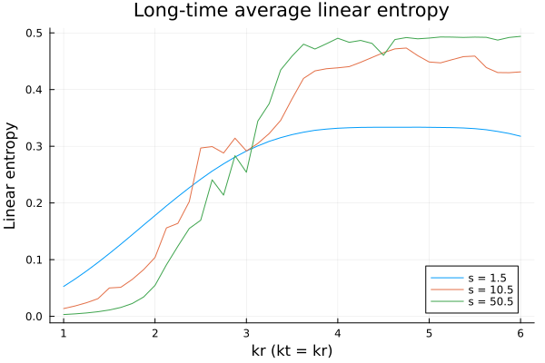
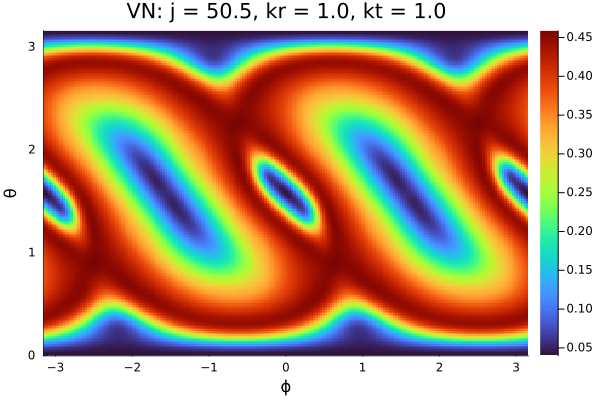

# QuantumKickedTop.jl

Julia tools for studying **quantum chaos and entanglement in the Quantum Kicked Top (QKT)** and its generalization, the **Double Kicked Top (DKT)**.

The Double Kicked Top extends the standard kicked top by introducing an additional, immediate, periodic kick with the same driving period as that of the first kick. The present package implements tools for studying **both models**, with the standard QKT appearing as a **special case of the DKT dynamics**.

This package provides implementations for

- classical and quantum kicked top dynamics  
- quantum information measures  
- visualization of chaos indicators such as entropy and Lyapunov exponents  

The code is designed for research in

- **Quantum chaos**
- **Floquet systems**
- **Entanglement in many-body quantum systems**
- **Classical–quantum correspondence**

---

# Physical Model

The **Quantum Kicked Top** is a periodically driven spin system described by a **Floquet operator**

$$
U = e^{-i\frac{k'}{2j}J_x^2} e^{-i\frac{k}{2j}J_z^2} e^{-ipJ_y}
$$

where

- $J_x, J_y, J_z$ are angular momentum operators  
- $k$ and $k'$ are the nonlinear kicking strengths 
- $p$ is the rotation parameter  
- $j$ is the spin quantum number  

The **Double Kicked Top (DKT)** extends this model by applying **two kicks within each driving period**.

The classical dynamics are obtained by evaluating:

$$
\vec{J}_{n+1} = U^\dagger \hspace{0.1cm} \vec{J}_n U,
$$

with $\vec{X}=\frac{\vec{J}}{j}$ and then taking limit $j\to\infty$. Here, the dynamically relevant parameters are given by

$$
k_r = \frac{k+k'}{2}, \hspace{0.1cm} k_\theta = \frac{k-k'}{2}.
$$

The parameter $k_r$ in the DKT exhibits a transition from **regular dynamics to strong chaos**, and related to the standard kicked top kicking strength $k = 2k_r$. The other parameter twists the phase space structures without disturbing chaos. This makes the DKT as an ideal models for studying **quantum chaos, entanglement generation and broken time-reversal symmetry**.

---

# Features

The package provides tools to compute and analyze:

## Classical Dynamics

- Classical kicked top map
- Lyapunov exponent estimation

## Quantum Dynamics

- Floquet operator construction
- Spin coherent states
- Eigenstate analysis

## Quantum Information Measures

### Von Neumann Entropy

$$
S = -\mathrm{Tr}(\rho \hspace{0.1cm} \log \hspace{0.1cm} \rho)
$$

### Linear Entropy

$$
S_L = 1 - \mathrm{Tr}(\rho^2)
$$

Additional measures include

- Quantum discord
- Concurrence

## Visualization

The package can generate

- Entropy heatmaps
- Linear entropy heatmaps
- Quantum discord heatmaps
- Lyapunov exponent heatmaps

## Parameter Scans

- Entanglement vs kick strength
- Entropy scans for different spin values

## Documentation

Detailed module documentation is available in the `docs/` directory.

---

# Installation

Clone the repository and activate the Julia environment.

```julia
using Pkg
Pkg.activate(".")
Pkg.instantiate()
```

Alternatively install directly from GitHub

```
using Pkg
Pkg.add(url="https://github.com/avadhut1987/QuantumKickedTop.jl")
```

# Project Structure
```QuantumKickedTop.jl
│
├── src/
│   ├── QuantumKickedTop.jl
│
│   ├── classical_dynamics/
│   │   ├── ClassicalMap.jl
│   │   └── ClassicalUtils.jl
│
│   ├── quantum_dynamics/
│   │   ├── FloquetSystem.jl
│   │   └── PhiStates.jl
│
│   ├── quantum_information_measures/
│   │   ├── QuantumUtils.jl
│   │   └── QuantumUtilsDiscord.jl
│
│   ├── eigenstate_entanglement_studies/
│   │   └── EigenstateEntanglement.jl
│
│   ├── parameter_scans/
│   │   └── LinearEntropyVsKR.jl
│
│   └── visualization/
│       ├── HeatmapEntropy.jl
│       ├── HeatmapDiscord.jl
│       ├── HeatmapLinearEntropy.jl
│       └── HeatmapLLE.jl
│
├── index-*.jl
├── img/
├── npy/
├── Project.toml
└── Manifest.toml
```
# Example Scripts
The repository contains several scripts demonstrating typical analyses. It is recommended to run them with the projject environment activated using ```--project``` flag. Example:
```
julia --project=. index-entropy.jl
```

## Running with Multiple Threads
For computationally intensive calculations (such as entropy landscapes or parameter scans), it is recommended to enable multi-threading.
```
julia --threads auto --project=. index-entropy.jl
julia --threads 8 --project=. index-entropy.jl
```

## Lyapunov Exponent Analysis
```index-lyapunov.jl```

Computes and visualizes **classical Lyapunov exponents**.

## Entanglement Entropy
```index-entropy.jl```

Computes entanglement **entropy of Floquet eigenstates**.
Results are saved in
- ```img/``` → generated plots

- ```npy/``` → numerical data files

## Linear Entropy
```index-linearentropy.jl```

Computes **linear entropy for given parameters**.

## Entropy Landscape
```
index-entropy-plot.jl
index-plot-linearentropy.jl
```


Generates **entropy landscapes across parameter space**.

## Quantum Discord
```index-discord.jl```

Computes **quantum discord for Floquet eigenstates**.

## Eigenstate Entanglement
```index-eee.jl```

Performs **eigenstate entanglement analysis**.


# Example Results
Example entropy landscape generated using this package

Example eigenstate entropy plot

# Output Data
Simulation results are stored in two directories.

### img/
Contains generated figures such as entropy heatmaps.

Example
```

entropy_50.5_partition_1_kr_1.0_kt_1.0.png
```


### npy/
Stores numerical datasets in ```.npz``` format.

Example
```
entropy_s1.5.npz

```
These files can be reused for plotting and further analysis.

## Basic Usage
Load the package

```
using QuantumKickedTop
```

Typical workflow
- Construct Floquet system
- Compute eigenstates
- Evaluate entanglement measures
- Visualize results

## References
- Haake, Fritz, M. Kuś, and Rainer Scharf.
*Classical and quantum chaos for a kicked top*, Zeitschrift für Physik B Condensed Matter **65.3 (1987): 381–395**.

- A. Seshadri, V. Madhok, and A. Lakshminarayan, *Tripartite mutual information, entanglement, and scrambling in permutation symmetric systems with an application to quantum chaos*, Phys. Rev. E **98, 052205 (2018)**.

- Purohit, Avadhut V., and Udaysinh T. Bhosale.
*Study of the double kicked top: A classical and quantum perspective*, Phys. Rev. E **112 (2025): 014217**.

## Citation
If you use this package in your research, please cite
```
Purohit, Avadhut V., and Udaysinh T. Bhosale.
*Study of the double kicked top: A classical and quantum perspective*, Phys. Rev. E 112, 014217 (2025).
```

## Author
Avadhut V. Purohit

GitHub https://github.com/avadhut1987

# License

This project is licensed under the MIT License.  
See the `LICENSE` file for details.
