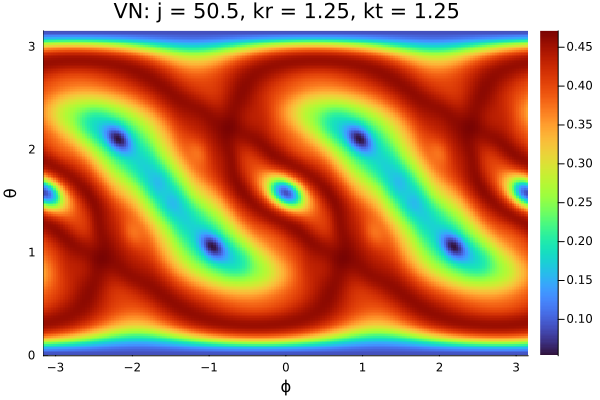
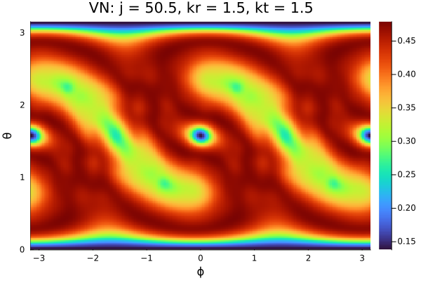
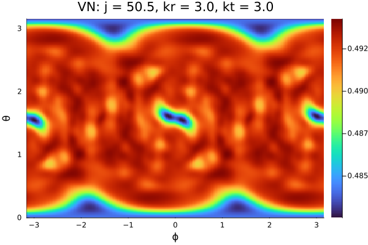

# Visualization and Heatmaps

This module provides tools for visualizing **quantum and classical indicators of chaos** through heatmaps and parameter-space plots.

The visualization framework is designed to be **generic**, allowing different physical quantities to be computed and visualized using a common pipeline.

---

# Overview

The visualization tools support plotting of:

- entanglement entropy  
- linear entropy  
- quantum discord  
- Lyapunov exponents  

All visualizations follow a **common workflow**, where a physical quantity is evaluated over a grid of parameters and displayed as a heatmap.

---

# General Workflow

The visualization process consists of the following steps:

## 1. Define Parameter Space

A grid of parameters is constructed, typically:

- kick strength \(k\)  
- rotation parameter \(p\)  
- (optionally) second kick parameter \(k'\)  

Example:

```julia
kr_values = range(0, 6, length=7)
```

---

## 2. Compute Observable

For each point in parameter space, a physical observable is computed.

This may involve:

- constructing the Floquet operator  
- computing eigenstates or evolving states  
- evaluating a quantum information measure  

Example (conceptual):

```julia
for k in kr_values
    U = floquet(j, p, k, kp)
    # compute observable (entropy, discord, etc.)
end
```

---

## 3. Store Results

The computed values are stored in an array or matrix:

```julia
results[i, j] = observable_value
```

This matrix represents the **phase diagram** of the system.

---

## 4. Generate Heatmap

The stored data is visualized as a heatmap:

- x-axis → parameter 1 (e.g. \(k\))  
- y-axis → parameter 2  
- color → value of observable  

---

# Heatmap Interpretation

Heatmaps provide a powerful way to identify:

- regions of regular dynamics  
- chaotic regimes  
- transitions between different dynamical phases  

Typical signatures include:

- smooth regions → regular motion  
- irregular/high-contrast regions → chaos  
- high entropy → strong entanglement  

---

# Implementation Structure

Visualization functionality is implemented in:

`src/visualization/`

which includes scripts for generating heatmaps of different observables.

Each file follows the same structure:

1. Define parameter grid  
2. Loop over parameters  
3. Compute observable  
4. Store results  
5. Plot heatmap  

---

# Algorithmic Structure

The general algorithm used in visualization is:

1. Initialize parameter grid  
2. Initialize result matrix  
3. For each parameter value:
   - construct Floquet operator  
   - compute required quantity  
   - store result  
4. Generate heatmap from matrix  

In pseudocode:

```julia
for i in eachindex(param1)
    for j in eachindex(param2)
        U = floquet(j_val, p_val, k_val, kp_val)
        observable = compute_quantity(U)
        results[i, j] = observable
    end
end
```

---

# Performance Considerations

Visualization routines can be computationally expensive due to:

- repeated Floquet operator construction  
- eigenvalue decompositions  
- entropy calculations  

To improve performance:

- use multi-threading (`Threads.@threads`)  
- reuse computed data where possible  
- store intermediate results in `.npz` files  

---

# Output

Results are typically saved in two forms:

## 1. Figures

Stored in:

`img/`

Examples include:

- entropy heatmaps  
- discord heatmaps  
- Lyapunov exponent plots  






---

## 2. Data Files

Stored in:

`npy/`

These files contain numerical data used to generate plots and can be reused for further analysis.

---

# Extensibility

The visualization framework is designed to be **generic**.

Any new observable can be visualized by:

1. Defining a function to compute the observable  
2. Plugging it into the parameter loop  
3. Storing results in a matrix  
4. Generating a heatmap  

This makes it easy to extend the package to new quantities without modifying the core structure.

---

# Scientific Context

Visualization plays a central role in studying **quantum chaos**, as many features of chaotic systems are best understood through parameter-space plots.

Heatmaps provide:

- a global view of system behavior  
- identification of chaotic regions  
- comparison between classical and quantum indicators  

They are widely used in studies of:

- kicked top models  
- Floquet systems  
- entanglement dynamics  
